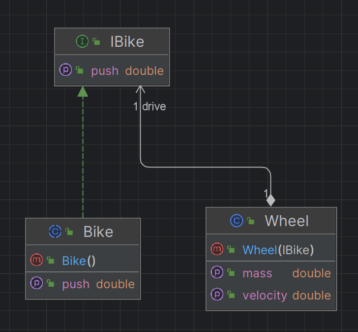

# Compte Rendu du TP 1 : Patrons de Conceptions

Noms des étudiants du binôme : BLUMET Thomas ABOUFATH Ibtissam

## Exercices 1
Il s'agit du pattern "composite", où `MobileObject` joue le rôle de classe composant et `Vehicle` le rôle de classe composite.
Pour la nouvelle classe il n'y a aps besoin de réécrire les 2 méthodes (l'héritage de `Vehicle` suffit), car les 2 méthodes utilisent 
soit un itérateur sur les composants, soit un flux de composants.

## Exercices 2
Il s'agit du patron Iterateur qui est utilisé dans **getVelocity()**, qui permet d'itérer/de parcourir les composants d'un véhicule
sans se préoccuper du type de déclaration des composants, offrant donc ici une méthode générique de calcul de vitesse.
En passant de **Set** à **List**, il n'y a pas besoin de changer la réalisation de **getVelocity()**, étant donné que la seule différence 
est que **Set** n'accepte pas les doublons, contrairement à **List**, ce qui ne pose pas de problème ici (on peut être tenter d'ajouter plusieurs
composants identiques)

## Exercices 3

## Exercices 4
1. Les classes de Bike et de Wheel font partie de différents packages. La classe de Bike est incluse dans le package fr.polytech.sim.cycling,
tandis que la classe de Wheel est incluse dans le package fr.polytech.sim.transport.  
Il existe une association bidirectionnelle entre les classes de Bike et de Wheel.
La classe Bike fait référence à Wheel, et chaque Wheel fait référence à la Bike à laquelle il appartient.
Il est nécessaire car le Wheel doit accéder à la méthode getPush() de la classe Bike afin de calculer sa vitesse.

L'association bidirectionnelle n'est pas généralement considèrer comme une bonne pratique dans la POO car elle crée une étroite connexion entre
les classes et peut entraîner des problèmes de maintenance et de flexibilité. Il y a également une dépendance circulaire qui peut engendrer des problèmes dans certaines situations.

2. La classe Wheel utilises la methode getPush() de la classe Bike pour calculer sa vitesse.
Il n'y a pas une abstraction une abstraction de la classe Bike, car la classe Wheel utilise directement la classe Bike pour calculer sa vitesse.

3. Pour resoudre le problème de dépendance circulaire entre les classes Bike et Wheel, il est possible de créer une interface qui encapsule la méthode getPush().
La classe Bike peut implémenter cette interface, et la classe Wheel peut alors dépendre de cette interface au lieu de la classe Bike directement.
Solution proposée :

Dans cette solution, l'interface IBike est introduite afin d'encapsular la méthode getPush().
Cette interface est utilisée par la classe Bike, tandis que la classe Wheel dépend désormais de l'interface IBike plutôt que de la classe Bike directement.
Cela rompt la dépendance circulaire entre les catégories de Bike et de Wheel.

## Exercices 5

## Exercices 6

## Exercices 7

## Exercices 8

